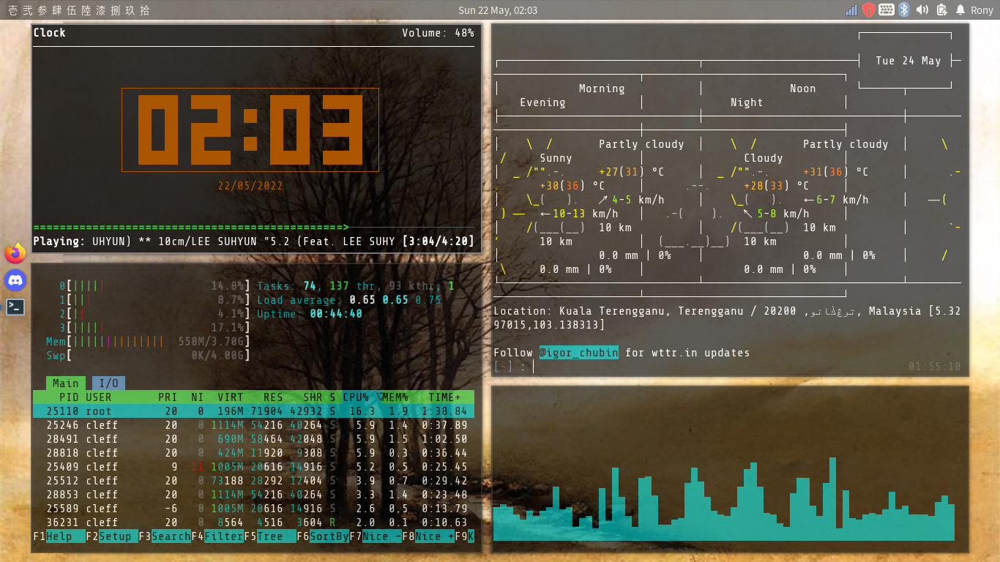
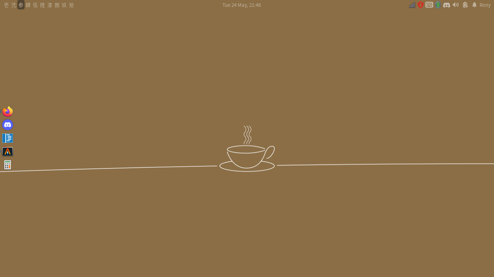

# What is this?

My Xfce+bspwm Build using xfce + plank + bspwm + sxhkd + rofi + picom  
aka. my "moderately" customized Xfce

# Screenshot

Picture of four xfce4-terminal instances separately running ncmpcpp, htop, wttr, cava

# Usage

Most keybindings are heavily affected by my dwm habits: 
 
Launch Terminal - Super + Shift + Enter  
Launch Application(rofi) - Super + P  
Focus Next Window - Super + K  
Focus Previous Window - Super + J  
Close Window - Super + Shift + C  
Restart/Exit bspwm - Super + Shift + Q  
Restart sxhkd - Super + Escape  
 
Switching Workspaces:  
Workspace 1-5 - Super + 1-5  
Workspace 6-10 - Super + F1-F5  
Moving Window Between Workspaces - Super + Shift + 1-5/F1-F5 
 
Switching Layouts:  
Default to Tiling Layout  
Toggle Monocle Layout - Super + M  
Toggle Floating Layout - Super + F  

# Repositories

- Github - https://github.com/ronylee11/xfce-bspwm
- Gitlab - https://gitlab.com/ronylee11/xfce-bspwm

# Useful Resources

- Inspiration from r/unixporn - https://www.reddit.com/r/unixporn/comments/kee3y9/xfce4bspwm_my_daily_set_up/
- Basic xfce+bspwm+sxhkd setup - https://github.com/bgdawes/bspwm-xfce-dotfiles/wiki#deactivate-xfwm4
- bspwm+sxhkd example - https://wiki.archlinux.org/title/bspwm
- picom example - https://wiki.archlinux.org/title/Picom
- rofi (dmenu alternative) - https://github.com/davatorium/rofi
- rofi theme - https://github.com/dctxmei/rofi-themes
- mouse & touchpad - https://wiki.archlinux.org/title/Mouse_acceleration
- fcitx5 (multi-language keyboard layouts) - https://wiki.archlinux.org/title/Fcitx5
- fcitx5 Nord theme - https://github.com/tonyfettes/fcitx5-nord
- bluetoothctl commands (bluetooth cli solution) - https://linuxcommandlibrary.com/man/bluetoothctl
- screendimmer (dimmer screen) - https://github.com/Lawrence-Chiappelli/screendimmer
- youtube-dl (youtube videos downloader) - https://wiki.archlinux.org/title/Youtube-dl
- spotdl - https://github.com/spotDL/spotify-downloader
- ncmpcpp (frontend for local music player) - https://wiki.archlinux.org/title/ncmpcpp
- mpd (backend for local music player) - https://wiki.archlinux.org/title/Music_Player_Daemon
